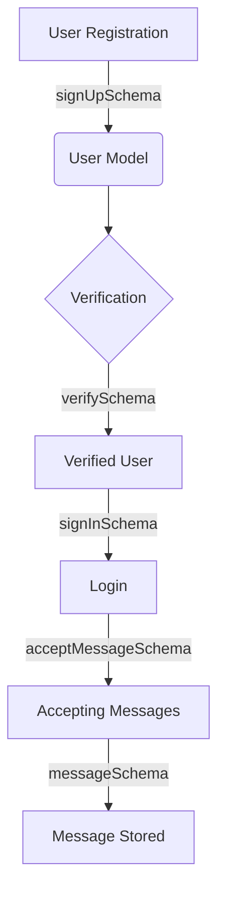

# Mystery Message Feature - Technical Documentation

---

## 📁 Project Structure

```
my-app/
├── .gitignore
├── eslint.config.mjs
├── next-env.d.ts
├── next.config.ts
├── package.json
├── postcss.config.mjs
├── README.md
├── tsconfig.json
├── public/
├── src/
│   ├── app/
│   │   ├── globals.css
│   │   ├── layout.tsx
│   │   └── page.tsx
│   ├── model/
│   │   └── User.ts
│   └── schemas/
│       ├── acceptMessageSchema.ts
│       ├── messageSchema.ts
│       ├── signInSchema.ts
│       ├── signUpSchema.ts
│       └── verifySchema.ts
```

---

## 🚀 Initialization Steps

1. **Project Setup**
    - Initialized a Next.js project with TypeScript.
    - Installed dependencies: `mongoose`, `next`, `eslint`, `postcss`, etc.
    - Configured TypeScript (`tsconfig.json`) and ESLint (`eslint.config.mjs`).

2. **Folder Structure**
    - `src/app`: Contains global styles, layout, and main page.
    - `src/model`: Contains Mongoose models.
    - `src/schemas`: Contains validation schemas for various features.

---

## 📦 Libraries Used

| Library         | Purpose                                    |
|-----------------|--------------------------------------------|
| `mongoose`      | MongoDB ODM for schema/model management    |
| `next`          | React framework for SSR and routing        |
| `eslint`        | Linting and code quality                   |
| `postcss`       | CSS processing                             |
| `typescript`    | Type safety and modern JS features         |
| `zod`           | TypeScript-first schema validation         |

---

## 🧩 Schema Design

### 1. **User Model (`User.ts`)**

- **Imports:**
    - `mongoose`, `Schema`, `Document`
- **Interfaces:**
    - `Message`: Represents a message with content and timestamp.
    - `User`: Represents a user with authentication and message fields.
- **Schemas:**
    - `MessageSchema`: Embedded in `UserSchema` for storing messages.
    - `UserSchema`: Stores user info, verification, and messages.

#### User Document Structure

| Field               | Type      | Description                          |
|---------------------|-----------|--------------------------------------|
| `username`          | String    | Unique username                      |
| `email`             | String    | Unique email, validated              |
| `password`          | String    | Hashed password                      |
| `verifyCode`        | String    | Code for email verification          |
| `verifyCodeExpiry`  | Date      | Expiry for verification code         |
| `isVerified`        | Boolean   | Email verified status                |
| `isAcceptingMessage`| Boolean   | Can receive messages                 |
| `messages`          | Array     | List of received messages            |

#### Message Document Structure

| Field      | Type   | Description           |
|------------|--------|----------------------|
| `content`  | String | Message text         |
| `createdAt`| Date   | Timestamp            |

---

### 2. **Validation Schemas (`schemas/`)**

| File                   | Purpose                                  |
|------------------------|------------------------------------------|
| `signUpSchema.ts`      | Validates user registration              |
| `verifySchema.ts`      | Validates email/code verification        |
| `signInSchema.ts`      | Validates user login                     |
| `acceptMessageSchema.ts`| Validates message acceptance toggle      |
| `messageSchema.ts`     | Validates message content                |

---

## 🏗️ Design Patterns & Decisions

### 1. **Model-Driven Design**
   - Centralized user and message data in Mongoose models.
   - Embedded message schema for efficient user-message relationship.

### 2. **Validation Layer**
   - Separate validation schemas for each feature.
   - Ensures data integrity before database operations.

### 3. **Modular Structure**
   - Clear separation between models, schemas, and UI.
   - Easy to extend and maintain.

### 4. **Type Safety**
   - TypeScript interfaces for all models and schemas.
   - Reduces runtime errors and improves developer experience.

---

## 🔄 Data Flow Diagram



---

## 📝 Example: User Model Code

```typescript
import mongoose, {Schema, Document} from "mongoose";

export interface Message extends Document{
    content: string;
    createdAt: Date
}

const MessageSchema: Schema<Message> = new Schema({
    content: { type:String, required: true },
    createdAt: { type:Date, required: true, default: Date.now }
})

export interface User extends Document{
    username: string;
    email: string;
    password: string;
    verifyCode:string;
    verifyCodeExpiry:Date;
    isVerified: boolean;
    isAcceptingMessage: boolean;
    messages: Message[]
}

const UserSchema: Schema<User> = new Schema({
    username: { type:String, required:[true, "Username is required"], trim: true, unique: true },
    email: { type:String, required: [true, "Email is required"], unique: true, match: [/.+\@.+\..+/, 'please use a valid email address'] },
    password: { type: String, required: [true, "Password is required"], minlength: [6, "Password must be at least 6 characters long"], maxlength: [100, "Password must be at most 100 characters long"] },
    verifyCode: { type: String, required: [true, "Verification code is needed"] },
    verifyCodeExpiry: { type: Date, required: [true, "Verification code expiry is needed"] },
    isVerified: { type:Boolean, default: true },
    isAcceptingMessage: { type: Boolean, default: true },
    messages: [MessageSchema]
})

const UserModel = (mongoose.models.User as mongoose.Model<User>) || (mongoose.model<User>("User", UserSchema))

export default UserModel;
```

---

## 🏁 Summary

- **Modular, type-safe, and scalable design.**
- **Clear separation of concerns (models, schemas, UI).**
- **Validation at every step for robust data integrity.**
- **Ready for further feature development and integration.**

---