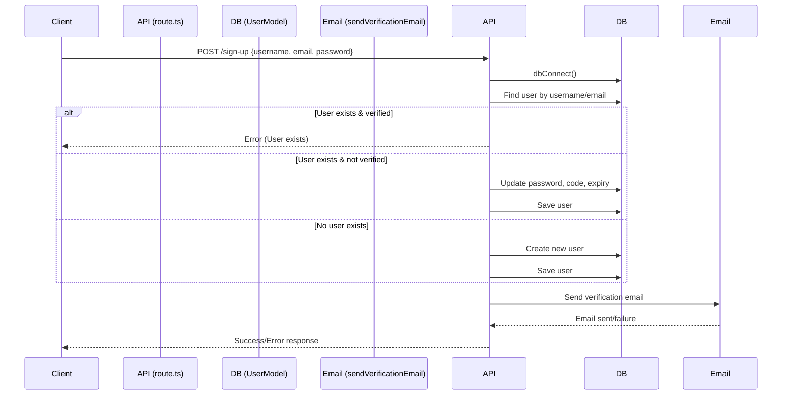

# SignUp Functionality - Technical Documentation

---

## 📁 Directory & File Overview

| Folder/File                       | Purpose                                                                 |
|-----------------------------------|-------------------------------------------------------------------------|
| `src/app/api/sign-up/route.ts`    | Main API route handling sign-up requests                                |
| `src/model/User.ts`               | Mongoose User schema and model definition                               |
| `src/lib/dbConnect.ts`            | MongoDB connection logic (singleton pattern)                            |
| `src/helpers/sendVerificationEmail.ts` | Helper to send verification email using Resend API                |
| `src/lib/resend.ts`               | Resend API client setup                                                 |
| `emails/VerificationEmail.tsx`    | React email template for verification code                              |
| `src/types/ApiResponse.ts`        | TypeScript interface for API responses                                  |

---

## 🛠️ Requirements

1. **MongoDB Database**  
   - Connection string in `.env` as `MONGODB_URI`.

2. **Resend API Key**  
   - API key in `.env` as `RESEND_API_KEY`.

3. **Node.js & Next.js Environment**  
   - Project initialized with Next.js and TypeScript.

4. **Required Libraries**  
   - `mongoose`, `bcryptjs`, `@react-email/components`, `resend`.

---

## 🧩 File & Folder Details

### 1. **API Route: `route.ts`**
- Handles POST requests for user registration.
- Connects to MongoDB using `dbConnect`.
- Checks for existing users by username and email.
- Hashes password using `bcryptjs`.
- Generates a verification code.
- Saves new or updates existing user (if not verified).
- Sends verification email via helper.
- Returns appropriate API response.

### 2. **User Model: `User.ts`**
- Defines the User schema with fields for username, email, password, verification code, expiry, verification status, message acceptance, and messages.
- Used for all user-related database operations.

### 3. **Database Connection: `dbConnect.ts`**
- Centralizes MongoDB connection logic.
- Ensures only one connection instance is used (singleton).
- Used in API routes before any database operation.

### 4. **Verification Email Helper: `sendVerificationEmail.ts`**
- Uses the Resend API to send verification emails.
- Imports the React email template.
- Returns a standardized API response.

### 5. **Resend Client: `resend.ts`**
- Initializes the Resend client with API key from environment variables.

### 6. **Email Template: `VerificationEmail.tsx`**
- React component for the verification email.
- Receives username and OTP, formats the email content.

### 7. **API Response Type: `ApiResponse.ts`**
- TypeScript interface for consistent API responses.

---

## 🔗 How Files Are Connected

- `route.ts` imports `dbConnect` for database connection, `UserModel` for user operations, `bcryptjs` for password hashing, and `sendVerificationEmail` for email sending.
- `sendVerificationEmail.ts` imports `resend` (API client), the email template, and the response type.
- The email template is used by the helper to format the verification email.
- All responses conform to the `ApiResponse` interface.

---

## 📝 High-Level Algorithm (from Image)

```
IF existingUserByEmail EXISTS THEN
    IF existingUserByEmail.isVerified THEN
        success: false,
    ELSE
        // Save the updated user
    END IF
ELSE
    // Create a new user with the provided details
    // Save the new user
END IF
```

### Step-by-Step Explanation

1. **Receive Request:**  
   - Extract `username`, `email`, and `password` from the request body.

2. **Connect to Database:**  
   - Ensure MongoDB is connected using `dbConnect`.

3. **Check Username:**  
   - If a verified user with the same username exists, return error.

4. **Check Email:**  
   - If a user with the same email exists:
     - If verified, return error.
     - If not verified, update password, verification code, expiry, and save.
   - If no user exists, create a new user with provided details, hash password, generate verification code, set expiry, and save.

5. **Send Verification Email:**  
   - Use `sendVerificationEmail` to send code to user's email.

6. **Return Response:**  
   - Success or error message based on outcome.

---

## 🔄 SignUp Flow Diagram



---

## 🧑‍💻 Example Usage

```typescript
// In route.ts
await dbConnect();
const existingUser = await UserModel.findOne({ email });
if (existingUser) {
    // ...algorithm as above
}
```

---

## 🏗️ Modular Steps for Reuse

1. **Create a model for your entity.**
2. **Centralize DB connection logic.**
3. **Write an API route to handle requests.**
4. **Validate input and check for existing records.**
5. **Hash sensitive data (like passwords).**
6. **Send notifications/emails as needed.**
7. **Return standardized responses.**

---

## 🏁 Summary

- All files are modular and reusable.
- The flow ensures data integrity and user experience.
- By following this structure, similar functionalities (like login, password reset) can be implemented easily.